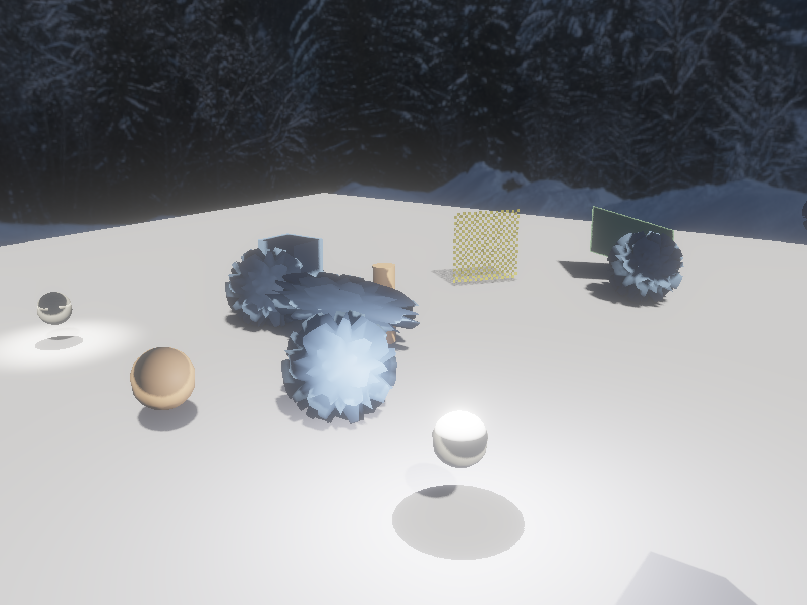
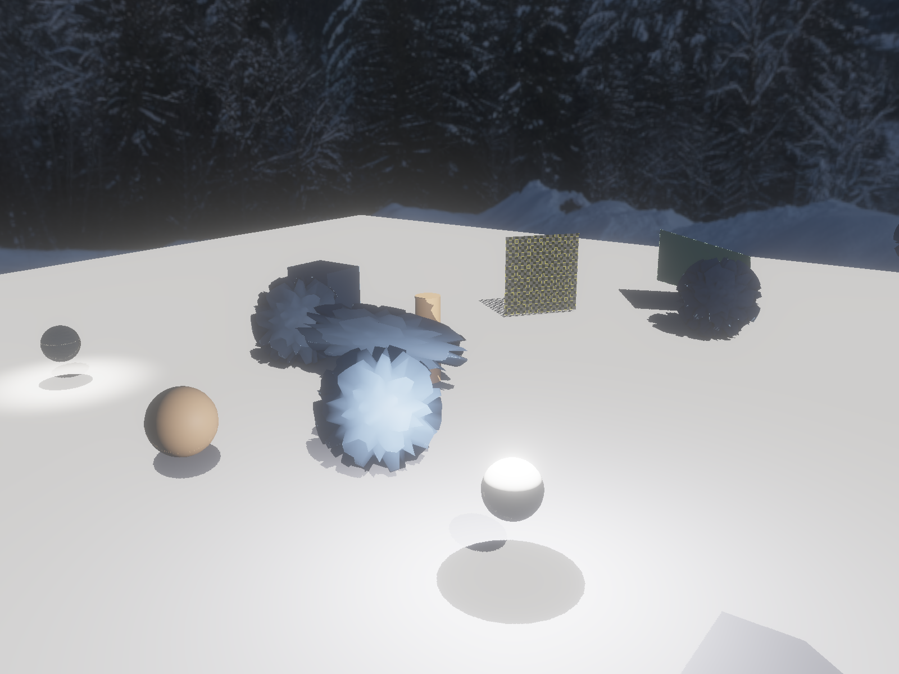

# Fire Engine — Acceptance Testing

Manual, visual sign-off for the renderer + physics. This is the runbook to walk before a branch
lands, to catch feature regressions a headless smoke test can't see — the kind that only show on
specific multi-material scenes (e.g. the thin-walled TransmissionTest roughness regression this
runbook surfaced, since fixed).

## How to run

- **Run every command from the `build/` directory** — assets are copied there flat, so scene paths
  have **no `assets/` prefix** (e.g. `DamagedHelmet/DamagedHelmet.gltf`).
- The app opens a window. Compare it against the reference image, then **close the window** (or
  `Ctrl-C` the terminal) to move on.
- **Validation layers are on** in the default (non-`NDEBUG`) build, so a clean render is also a
  **0-VUID** render. For a headless pass/fail, background the app and grep stderr (see [`CLAUDE.md`](../CLAUDE.md)).
- **Both CLI args are optional.** With **no scene**, only programmatically-added content renders
  (the `-p`/`-c`/`-k`/`-q` demos) — there is no fallback asset. With **no skybox**, the scene is lit
  by the default environment's IBL but **no sky is drawn** (neutral background), at a calmer IBL
  level. Pass `skybox.hdr` (bright) or `nightbox.hdr` (dark) to draw + light with that environment.
- **Shadow work uses `nightbox.hdr`.** `skybox.hdr`'s ambient IBL washes receivers out until shadows
  are barely readable; the night environment is dim enough to judge shadow shape and contrast. The
  shadow-LOD scenes and their reference captures are all night-lit.
- **`--capture <path.png>`** writes a frame and exits, for reproducible references:
  `--capture-frame N` picks the frame by NUMBER (not elapsed time), and `--no-lod` forces full detail
  for an A/B. Add `--no-taa` so the image is one rasterised frame rather than accumulated history,
  and leave `--overlay` off — its text changes every run.

### ⚠️ Verify the reference images

The reference-image links point at the Khronos **glTF-Sample-Models** repo and are **best-guess
URLs** (most models use `screenshot/screenshot.jpg`; some use a different name — `.gif`, `.png`,
`screenshot_large*.jpg`, etc., and a few newer models may only live in the successor
`glTF-Sample-Assets` repo). **Expect some to 404.** When one is wrong, replace it with the correct
filename or with `placeholder.jpg`. Engine-authored / physics / generated scenes use `placeholder.jpg`
by design (no upstream image).

---

## Khronos glTF 2.0 sample models

Source repo: <https://github.com/KhronosGroup/glTF-Sample-Models/tree/main/2.0>

### AlphaBlendModeTest — alpha OPAQUE / MASK / BLEND + double-sided
```bash
./fireEngineApp AlphaBlendModeTest/AlphaBlendModeTest.gltf skybox.hdr
```
[Source](https://github.com/KhronosGroup/glTF-Sample-Models/tree/main/2.0/AlphaBlendModeTest)


### AnimatedCube — node rotation animation
```bash
./fireEngineApp AnimatedCube/AnimatedCube.gltf skybox.hdr
```
[Source](https://github.com/KhronosGroup/glTF-Sample-Models/tree/main/2.0/AnimatedCube)


### AnimatedMorphCube — morph-target animation
```bash
./fireEngineApp AnimatedMorphCube/AnimatedMorphCube.gltf skybox.hdr
```
[Source](https://github.com/KhronosGroup/glTF-Sample-Models/tree/main/2.0/AnimatedMorphCube)


### BoomBoxWithAxes — PBR metal/rough + orientation axes
```bash
./fireEngineApp BoomBoxWithAxes/BoomBoxWithAxes.gltf skybox.hdr
```
[Source](https://github.com/KhronosGroup/glTF-Sample-Models/tree/main/2.0/BoomBoxWithAxes)


### BoxAnimated — hierarchical node animation
```bash
./fireEngineApp BoxAnimated/BoxAnimated.gltf skybox.hdr
```
[Source](https://github.com/KhronosGroup/glTF-Sample-Models/tree/main/2.0/BoxAnimated)


### BrainStem — skinned skeletal animation
```bash
./fireEngineApp BrainStem/BrainStem.gltf skybox.hdr
```
[Source](https://github.com/KhronosGroup/glTF-Sample-Models/tree/main/2.0/BrainStem)


### Cameras — embedded camera nodes
```bash
./fireEngineApp Cameras/Cameras.gltf skybox.hdr
```
[Source](https://github.com/KhronosGroup/glTF-Sample-Models/tree/main/2.0/Cameras)


### CesiumMan — skinned character (walk)
```bash
./fireEngineApp CesiumMan/CesiumMan.gltf skybox.hdr
```
[Source](https://github.com/KhronosGroup/glTF-Sample-Models/tree/main/2.0/CesiumMan)


### ClearCoatTest — KHR_materials_clearcoat
```bash
./fireEngineApp ClearCoatTest/ClearCoatTest.gltf skybox.hdr
```
[Source](https://github.com/KhronosGroup/glTF-Sample-Models/tree/main/2.0/ClearCoatTest)


### DamagedHelmet — opaque PBR (normal / emissive / AO / metal-rough)
```bash
./fireEngineApp DamagedHelmet/DamagedHelmet.gltf skybox.hdr
```
[Source](https://github.com/KhronosGroup/glTF-Sample-Models/tree/main/2.0/DamagedHelmet)


### DragonAttenuation — transmission + volume
```bash
./fireEngineApp DragonAttenuation/DragonAttenuation.gltf.gltf skybox.hdr
```
[Source](https://github.com/KhronosGroup/glTF-Sample-Models/tree/main/2.0/DragonAttenuation)


### EmissiveStrengthTest — KHR_materials_emissive_strength + bloom
```bash
./fireEngineApp EmissiveStrengthTest/EmissiveStrengthTest.gltf skybox.hdr
```
[Source](https://github.com/KhronosGroup/glTF-Sample-Models/tree/main/2.0/EmissiveStrengthTest)


### Fox — skinned run cycle
```bash
./fireEngineApp Fox/Fox.gltf skybox.hdr
```
[Source](https://github.com/KhronosGroup/glTF-Sample-Models/tree/main/2.0/Fox)


### InterpolationTest — STEP / LINEAR / CUBICSPLINE animation
```bash
./fireEngineApp InterpolationTest/InterpolationTest.gltf skybox.hdr
```
[Source](https://github.com/KhronosGroup/glTF-Sample-Models/tree/main/2.0/InterpolationTest)


### LightsPunctualLamp — KHR_lights_punctual (point / spot / directional)
```bash
./fireEngineApp LightsPunctualLamp/LightsPunctualLamp.gltf skybox.hdr
```
[Source](https://github.com/KhronosGroup/glTF-Sample-Models/tree/main/2.0/LightsPunctualLamp)


### MetalRoughSpheres — metal × roughness grid
```bash
./fireEngineApp MetalRoughSpheres/MetalRoughSpheres.gltf skybox.hdr
```
[Source](https://github.com/KhronosGroup/glTF-Sample-Models/tree/main/2.0/MetalRoughSpheres)


### MorphPrimitivesTest — morph targets across primitives
```bash
./fireEngineApp MorphPrimitivesTest/MorphPrimitivesTest.gltf skybox.hdr
```
[Source](https://github.com/KhronosGroup/glTF-Sample-Models/tree/main/2.0/MorphPrimitivesTest)


### OrientationTest — node orientation / coordinate handedness
```bash
./fireEngineApp OrientationTest/OrientationTest.gltf skybox.hdr
```
[Source](https://github.com/KhronosGroup/glTF-Sample-Models/tree/main/2.0/OrientationTest)


### RecursiveSkeletons — nested / recursive skins
```bash
./fireEngineApp RecursiveSkeletons/RecursiveSkeletons.gltf skybox.hdr
```
[Source](https://github.com/KhronosGroup/glTF-Sample-Models/tree/main/2.0/RecursiveSkeletons)


### RiggedSimple — simple single skin
```bash
./fireEngineApp RiggedSimple/RiggedSimple.gltf skybox.hdr
```
[Source](https://github.com/KhronosGroup/glTF-Sample-Models/tree/main/2.0/RiggedSimple)


### StainedGlassLamp (KTX2) — KTX2/Basis textures + transmission + emissive
```bash
./fireEngineApp StainedGlassLampKTX/StainedGlassLamp.gltf skybox.hdr
```
[Source](https://github.com/KhronosGroup/glTF-Sample-Models/tree/main/2.0/StainedGlassLamp)


### TextureCoordinateTest — UV coordinate mapping
```bash
./fireEngineApp TextureCoordinateTest/TextureCoordinateTest.gltf skybox.hdr
```
[Source](https://github.com/KhronosGroup/glTF-Sample-Models/tree/main/2.0/TextureCoordinateTest)


### TextureLinearInterpolationTest — sRGB vs linear texture filtering
```bash
./fireEngineApp TextureLinearInterpolationTest/TextureLinearInterpolationTest.gltf skybox.hdr
```
[Source](https://github.com/KhronosGroup/glTF-Sample-Models/tree/main/2.0/TextureLinearInterpolationTest)


### TextureSettingsTest — sampler wrap / filter modes
```bash
./fireEngineApp TextureSettingsTest/TextureSettingsTest.gltf skybox.hdr
```
[Source](https://github.com/KhronosGroup/glTF-Sample-Models/tree/main/2.0/TextureSettingsTest)


### TransmissionRoughnessTest — transmission × roughness
```bash
./fireEngineApp TransmissionRoughnessTest/TransmissionRoughnessTest.gltf skybox.hdr
```
[Source](https://github.com/KhronosGroup/glTF-Sample-Models/tree/main/2.0/TransmissionRoughnessTest)


### TransmissionTest — KHR_materials_transmission
Multi-material transmission grid. The **roughness column** should vary visibly frosted → clear, and
the **rows** should vary by transmission factor / opacity / texture — match the reference grid.
(This scene surfaced a regression where all thin-walled spheres rendered identically regardless of
`roughnessFactor`; fixed 2026-07-06 by making thin-walled transmission sample the roughness-blurred
scene per spec.)
```bash
./fireEngineApp TransmissionTest/TransmissionTest.gltf skybox.hdr
```
[Source](https://github.com/KhronosGroup/glTF-Sample-Models/tree/main/2.0/TransmissionTest)


### VertexColorTest — per-vertex COLOR_0
```bash
./fireEngineApp VertexColorTest/VertexColorTest.gltf skybox.hdr
```
[Source](https://github.com/KhronosGroup/glTF-Sample-Models/tree/main/2.0/VertexColorTest)


---

## Environment maps (skyboxes)

The two shipped HDR environments, each verified against a known subject (`DamagedHelmet`) so the sky,
its reflections, and the IBL tint are all visible. Passing the skybox both draws it as the background
and drives the IBL. (Omitting it renders no background + a calmer default IBL — see the note at the
top.) Images are `placeholder.jpg` for now.

### skybox.hdr — bright daytime environment
```bash
./fireEngineApp DamagedHelmet/DamagedHelmet.gltf skybox.hdr
```


### nightbox.hdr — dark night environment
```bash
./fireEngineApp DamagedHelmet/DamagedHelmet.gltf nightbox.hdr
```


---

## Engine-authored scenes

Original assets (no upstream source / image). Reference images are `placeholder.jpg` for now.

### CesiumManRagdoll — articulated ragdoll settling on a floor (needs `-f`)
Falls and settles into a plausible pose; without `-f` there is no floor and it falls through. The
knees and elbows are authored as true 1-DOF hinges (`extras.Ragdoll.Joints`), so the limbs fold one
way about their hinge axis rather than swinging in a cone.
```bash
./fireEngineApp CesiumMan/CesiumManRagdoll.gltf skybox.hdr -f
```


Add `--debug-joints` (or overlay **View → Joints**) to replace the mesh with the per-joint RGB axis
gizmo + "index: bone-name" labels — used to author/verify the hinge axes. The labels should track the
joints as the camera moves, and turning the view off should restore the mesh with no leftover gizmo.
```bash
./fireEngineApp CesiumMan/CesiumManRagdoll.gltf skybox.hdr -f --debug-joints
```


### ClothBanner — authored `extras.Cloth` (pinned banner)
Cloth hangs from its pinned edge and sways.
```bash
./fireEngineApp ClothBanner/ClothBanner.gltf skybox.hdr
```


### ClothSheet — authored `extras.Cloth` (free sheet)
```bash
./fireEngineApp ClothSheet/ClothSheet.gltf skybox.hdr
```


### Pong — the bundled mini-game
```bash
./fireEngineApp Pong/Pong.gltf skybox.hdr
```


---

## Shadow-LOD acceptance scenes (SH-01)

Generated by `assets/shadow_lod/generate.py` ([`shadowplans.md`](shadowplans.md) § SH-01). They
carry their own floor receiver and their own sun, spot and point lights — **no `-f`, and pass a
skybox only if you want sky lighting on top**. The scene is deliberately dense: an off-camera caster
whose shadow is its only evidence, one shared 1280-triangle spiky sphere at identity scale, at
non-uniform scale, and at three cascade distances, spot- and point-lit casters, a skinned limb, a
morphed box, an alpha-masked cutout with a real cutout texture, and a zero-thickness double-sided
sheet.

**Every caster meant to demonstrate LOD clears the engine's 512-triangle threshold** (624–1280
triangles, connected) and builds three levels — the generator asserts it. Simple boxes would sit at
12 triangles, report `SingleLevel`, and quietly measure nothing.

**Use `nightbox.hdr`, not `skybox.hdr`.** All shadow testing uses the night environment: `skybox.hdr`
drives enough ambient IBL to wash the receiver out, and faint shadows on a near-white floor can't be
judged by eye. The reference captures below are night-lit for the same reason.

**The two files have different jobs. Do not mix them up.**

### ShadowLodDemo — the static measurement baseline
```bash
./fireEngineApp shadow_lod/ShadowLodDemo.gltf nightbox.hdr --overlay
```
Everything is static, so the authored camera pose makes this reproducible run to run. Walk it in
this order:

1. **Shadows (SH-01) panel** — every family that should be rasterising is: cascades (4 slots), spot,
   point (6 faces of slot 0), self (the skinned limb). Read the columns knowing what each pair
   means: `Draws d/c` is drawn over offered, and the difference is that view's cull yield;
   `Tris d/c` is drawn over **full detail**, so its difference is culling *and* LOD together;
   `L0..L3+` are the LOD selections of the DRAWN casters — a rejected candidate is never resolved,
   so it contributes no level — counted once per logical view (a self slot rasterises twice and is
   sampled once).

   Since SH-03, **the level columns should differ between views** — that is the fix, visible. On
   this scene the near cascade keeps a handful of casters at L0/L1 while the far cascade keeps more
   of them coarser, and the skinned limb's own tight self-shadow map picks a coarser level than the
   cascades do. Identical distributions across every cascade would mean per-view selection has
   stopped working.
2. **Click a slot row** — the reason table above retargets to that view alone. `selected` means the
   budget was met deliberately; anything in the fallback rows is a forced LOD0 and worth chasing.
   "Scene total" returns to the rollup.

   The selection follows the **view**, not the row: it is stored as that view's logical identity, so
   if a light leaves and the punctual slots compact, the focus moves to wherever that view now sits
   rather than silently reporting its replacement. Two header messages mean different things —
   "not present in this frame" (a well-formed selection that was not found; the panel deliberately
   does NOT claim whether it will come back, since a removed light and a light that simply did not
   rasterise are indistinguishable without scene liveness) versus "selection is not a valid view"
   (structurally malformed — no frame can satisfy it, so pick another row).
3. **View → LOD tint, then View → Shadow LOD tint** — the camera level and, currently, a neutral
   grey everywhere. Since SH-03 a caster holds a *different* level per shadow view, so there is no
   single number to tint by; slice 5 wires the tint to the focused view, and until then grey is the
   honest answer rather than a level no view used. The floor reads that same grey for a different
   reason — it is authored `extras.Shadow: {"Casts": false}`, so it receives shadows without casting
   one. If it ever tints green instead, the receive-only flag has stopped being applied, and you'll
   see it as the whole floor darkening in the normal view, because a flat caster fails its own depth
   comparison across its entire area.
4. **Off-camera caster** — the sun sits over the camera's shoulder (~46° elevation), so shadows fall
   away from you. This caster is ~74° off the view axis and never on screen, but its shadow lands on
   open floor near x 14, z 11 — front-right of the view. It must not vanish or change silhouette as
   the camera turns.
5. **Cutout and sheet** — out at z ≈ −8 and z ≈ −12, deliberately beyond every punctual light's
   reach so the **sun is the only light that can cast from them** (the generator asserts it). Both
   are **known** SH-05 exposures: record what you see, don't "fix" them here.
   - The cutout casts a **solid rectangle** on the floor around x [−4.1, −0.3], z [−10.8, −6.9],
     while the surface itself is visibly perforated: `shadow.frag` samples no texture at all, so the
     alpha mask has no effect on its shadow. It is authored double-sided because it must be: to cast
     at all, the sun has to be on its back side (the shadow pass culls front faces), which puts the
     camera on the back face too — so a single-sided flat caster cannot be both visible and casting
     in the engine today. That constraint is itself an SH-05 note.
   - The sheet is a zero-thickness quad turned **face-on to the sun** (the generator computes the
     rotation, and asserts it isn't near edge-on — an edge-on quad projects to a line, which is
     indistinguishable from casting nothing). You see its **lit** face; the floor beneath it, around
     x [−0.5, 5.0], z [−15.0, −10.9], stays **clear**. That gap is the finding: the shadow pipeline
     fixes `cullMode = eFront` (`Pipeline::shadowConfig`, non-dynamic) while the forward pass draws
     both sides of a double-sided material, so the shadow pass culls the only faces the quad has.
     When SH-05 makes the two passes agree, this same node starts casting a full quad there — no
     re-authoring needed. Note the verdict is **per light**: a punctual light on the quad's back
     side would keep exactly the faces the sun's view culls, which is why both flat quads are placed
     beyond punctual reach.

#### Reference captures

Regenerate both with the engine itself — no window-grabbing, and no `--overlay` (its timing text
would make every pixel differ run to run):

```bash
./fireEngineApp shadow_lod/ShadowLodDemo.gltf nightbox.hdr \
  --no-taa --capture-frame 16 --capture ../docs/images/shadow-lod-selected.png

./fireEngineApp shadow_lod/ShadowLodDemo.gltf nightbox.hdr \
  --no-taa --no-lod --capture-frame 16 --capture ../docs/images/shadow-lod-full-detail.png
```

`--no-taa` makes each image one unambiguous rasterised frame rather than accumulated temporal
history. `--capture-frame` counts **frames, not seconds**, so any machine captures the same **render
ordinal** — but note that is not the same as identical content: the main loop still advances
animation and physics from wall-clock `dt`, so a slower machine reaches frame 16 with the scene in a
different state. Reproducible content therefore requires a **static** scene, which is exactly what
`ShadowLodDemo` is (and why the motion variant has no reference image). The app writes the PNG and
exits — non-zero with a fatal log if it could not write it — so this is scriptable.

**Extent is the swapchain's, not the window's.** The window is 800×600 logical, but on a HiDPI
display the swapchain is the 2× backing store — these captures are **1600×1200** on this Mac and
would be 800×600 on a non-HiDPI machine. Compare like with like.

**These are documented baselines, not a pass/fail gate.** Identical input pixels encode to identical
PNG bytes, but the Vulkan output itself is not guaranteed byte-identical across GPUs, drivers or
platforms, so a hash comparison would produce false failures. The enforceable tolerance arrives with
SH-02's shadow-texel metric; until then these record what the engine did on the day.

| Selected LOD (default) | Full detail (`--no-lod`) |
|---|---|
|  |  |

The pair differs on ~0.4% of pixels, all of it on LOD'd silhouettes and the shadows they cast — most
visibly the near sphere, whose shadow is a faceted polygon at the selected level and a smooth ellipse
at full detail.

### ShadowLodMotionDemo — the qualitative stability loop
```bash
./fireEngineApp shadow_lod/ShadowLodMotionDemo.gltf nightbox.hdr --overlay
```
Same content, plus a caster crossing the cascade bands, a swinging sun, a swinging skinned limb and
a pulsing morph. **This is not a screenshot reference** — an animated frame has no reproducible
timestamp. Watch a full loop for: shadow silhouettes popping as the caster crosses a cascade
boundary, level chatter (a shadow flickering between two detail levels), and the skinned limb's
shadow separating from the limb. Report what you saw; there is no numeric gate until SH-02 defines
the shadow-texel bound.

(No reference image: an animated frame has no reproducible timestamp, so a capture of it would prove nothing.)

---

## Physics demos

Generated by `assets/physics_demos/generate.py`, each mirrored by a headless replay test in
`tests/physics/test_demos.cpp`. They carry their own floor — no `-f` needed. Enable
`--debug-physics` to overlay collider / contact wireframes. Images are `placeholder.jpg` for now.

### CompoundDemo — compound (multi-shape) collider settles upright
```bash
./fireEngineApp physics_demos/CompoundDemo.gltf skybox.hdr
```


### ConvexHullDemo — GJK/EPA convex hull rests on the floor
```bash
./fireEngineApp physics_demos/ConvexHullDemo.gltf skybox.hdr
```


### FallRestDemo — a body falls and comes to rest
```bash
./fireEngineApp physics_demos/FallRestDemo.gltf skybox.hdr
```


### FrictionRampDemo — boxes on ramps of increasing friction slide differently
```bash
./fireEngineApp physics_demos/FrictionRampDemo.gltf skybox.hdr
```


### RestitutionDemo — bouncing bodies (restitution)
```bash
./fireEngineApp physics_demos/RestitutionDemo.gltf skybox.hdr
```


### SingleJointRagdollDemo — single-joint ragdoll settles
```bash
./fireEngineApp physics_demos/SingleJointRagdollDemo.gltf skybox.hdr
```


### SleepDemo — bodies settle, then sleep (stop integrating)
```bash
./fireEngineApp physics_demos/SleepDemo.gltf skybox.hdr
```


### StackDemo — a box stack stays standing (solver stability)
```bash
./fireEngineApp physics_demos/StackDemo.gltf skybox.hdr
```


### StaticMeshDemo — bodies rest on a static triangle mesh
```bash
./fireEngineApp physics_demos/StaticMeshDemo.gltf skybox.hdr
```


### ToppleDemo — a box topples onto a face and rests
```bash
./fireEngineApp physics_demos/ToppleDemo.gltf skybox.hdr
```


### TwoJointRagdollDemo — two-joint ragdoll settles
```bash
./fireEngineApp physics_demos/TwoJointRagdollDemo.gltf skybox.hdr
```


---

## Generated feature demos (command-line flags)

These add procedurally-built content at startup; they carry no `.gltf`. The commands pass **no scene
and no skybox** — so only the generated content renders (no fallback asset), lit by the default
environment's IBL against a neutral background (no sky drawn). Add `skybox.hdr` to draw a sky behind
them. Flags are position-independent. Images are `placeholder.jpg` for now.

### Particles — `-p` (GPU compute + instanced additive billboards + bloom)
```bash
./fireEngineApp -p
```


### Cloth — `-c` (GPU XPBD sheet drapes over a sphere onto the ground)
```bash
./fireEngineApp -c
```


### Character controller — `-k` (kinematic capsule on an obstacle course: walk / step / climb / slide)
```bash
./fireEngineApp -k
```


### Query probe — `-q` (ring of static bodies queried each frame; run with `--debug-physics` to see it)
```bash
./fireEngineApp -q --debug-physics
```


### Floor — `-f` (adds a receiver-only ground plane; combine with any of the above)
```bash
./fireEngineApp -f -p
```


---

## Feature checks (overlay-driven)

### Mesh LOD — discrete / VIPM / VDPM
```bash
./fireEngineApp DamagedHelmet/DamagedHelmet.gltf skybox.hdr --overlay
```
In the **"Mesh LOD"** overlay panel, with the helmet filling most of the screen and the pixel-error
budget near default:
- **Discrete** — backing the camera off (or raising the budget) should **step** the mesh coarser; the
  "LOD tint" debug view (View dropdown → LOD tint) colours by level (green → yellow → red) and you
  should see a hard swap at each step.
- **Continuous (VIPM)** — the same transitions should now **dissolve** instead of popping; the texture
  must not shear at the mirrored front seam as a level changes.
- **View-dependent (VDPM)** — at a matched budget the mesh should look **the same as Discrete's finest
  visible detail but with far fewer triangles** (watch "Triangles drawn"). Flipping between VDPM and
  Discrete/VIPM should show **no background leaking through** (no missing front-facing triangles), no
  silhouette holes, and no flicker with the camera still. This is the case the VDPM foldover +
  coverage repair passes exist to guarantee — see [`lod.md`](lod.md).

#### VDPM indirect draw (Stage A of the GPU-driven front)
VDPM draws are issued with `drawIndexedIndirect`. Launch straight into it (no overlay toggle needed):
```bash
./fireEngineApp DamagedHelmet/DamagedHelmet.gltf skybox.hdr --lod-mode view-dependent
./fireEngineApp TransmissionTest/TransmissionTest.gltf skybox.hdr --lod-mode view-dependent
```
The image must be **identical** to the overlay-selected VDPM (the indirect command carries the same
index count the direct path used), and the validation layers must stay **silent** — the smoke check
`grep -icE 'VUID|validation error'` on the backgrounded run's stderr should print `0`. DamagedHelmet
exercises the forward + depth-prepass sites; TransmissionTest's dense transmissive meshes exercise the
transmission site. This is the MoltenVK `drawIndexedIndirect` de-risk.

#### VDPM GPU-driven front (Stage B5b/B5c) — CPU↔GPU backend parity sign-off
`--vdpm-gpu` runs the whole per-frame front lifecycle (score → refine/coarsen → repair → emit) on the
GPU and draws from the GPU-emitted index/indirect buffers; omit it for the CPU front. Both need
`--lod-mode view-dependent` and a compute/scan-capable device. Since **B5c-3 the backend is a runtime
overlay toggle**, so the A/B is a **same-process, same-camera** flip — not two independent launches
(which would compare different camera poses and prove nothing about the counts). The manager is built
whenever the device supports the GPU front, independent of the selector, so the toggle takes effect the
next frame with **no reload** and an unsupported device shows an explicit "unsupported" label and stays
on the CPU front.

**The empirical parity gate (same camera, one process).** This is an *empirical* gate. Two realities of
a real VDPM asset shape it — **do not chase a zero-repair state, it does not exist here:**
- **Repair is load-bearing, not a fault.** The helmet's front carries a persistent non-zero foldover
  repair count at every coarse level (observed floor ~40; pushing coarser makes it *worse* via the
  coarsest-level seam). This is **consistent with, and likely amplified by, the ~7 forest skips**
  (`buildVertexForest` drops collapses that diverge from its adjacency replay; past the first skip the
  forest is slightly unfaithful — see [`lod.md`](lod.md)) — but it is *not* proven to be the sole cause:
  selective non-prefix fronts can require foldover repair even with a perfectly faithful forest. Either
  way the repair is doing genuine correctness work every frame; a foldover/coverage count of 0 is **not a
  reachable plateau** and must not be a precondition.
- **A stable count does not prove no internal churn.** The lifecycle can coarsen a region and repair it
  back every frame while emitting an *identical* final count — the repair is load-bearing for
  *correctness*, but the repeated work is still computational *churn*. So "stable Triangles drawn"
  identifies a stable **final front**, not a quiescent lifecycle. That is enough for a parity A/B (both
  backends reach the same stable output); it is not a claim about wasted work.

So the parity gate is **visual equivalence + clean GPU health flags**; the counts are recorded and any
CPU/GPU delta is explicitly assessed, never silently tolerated (no undefined "close"). Structural index
identity is owned by the headless `test_vdpm_helmet_evidence.cpp` (B5c-2, Claim A), not by these counts.

1. Launch with the overlay **and `--no-vdpm-gpu`** (the backend is on by default since B5c-4, so start it
   on the CPU front for the A/B); in **Mesh LOD**, set **Mode → View-dependent (VDPM)**. Confirm the
   **"GPU-driven front"** checkbox is **unticked**.
2. Back the camera off (or raise the pixel-error budget) until the **rendered output is a stable plateau**
   — "Triangles drawn" holds steady frame-to-frame — at a low-detail but **still-recognisable** mesh.
   Read the CPU **"VDPM repairs (CPU fronts)"** counters: they may be non-zero; require them **stable**
   and **record** them (they are repair *work*, not a failure).
3. Freeze the camera and the budget (don't touch them for the rest of the gate). Record **CPU₁** count.
4. Tick **"GPU-driven front"** in the same panel.
5. Wait for the front to settle **and** the delayed diagnostics to warm up — "Triangles drawn" briefly
   reads **"pending GPU readback"**; wait until it shows a stable number again. Record **GPU₁** count.
6. **Require at the plateau:** **"VDPM GPU health" max marked rounds** may be non-zero but must be
   **stable, below the round budget, and converge without fallback**; and **fallback 0, non-clean 0,
   ancestor-fail 0, B3-fail 0**, no `EMITTED OVERFLOW`. Record the count **delta (absolute and %)** vs
   CPU₁ and assess it explicitly against the visual check — equal is the strong signal; a small delta
   with no visible difference is a *recorded, assessed* pass, a delta with a visible difference is a fail.
7. Untick the toggle; record **CPU₂**. **Backend self-consistency: CPU₂ must equal CPU₁ exactly**
   (reload-free round trip). Optionally re-tick GPU and confirm its count repeats exactly.

**Consumer-path equivalence + 0-VUID smoke.** With the same in-process toggle, exercise each draw-site
consumer and confirm the image stays **equivalent + hole-free** across the flip (no background leaking
through, no silhouette holes, no flicker with the camera still, no shimmer under a slow orbit), and that
`grep -icE 'VUID|validation error'` on a backgrounded run prints `0`:
```bash
# Opaque forward + depth-prepass
./fireEngineApp DamagedHelmet/DamagedHelmet.gltf skybox.hdr --lod-mode view-dependent --no-vdpm-gpu --overlay
# Blend + double-sided (no depth-prepass consumer, cull none, blend bucket/pipeline) — a dense
# DamagedHelmet copy re-materialised alphaMode BLEND + doubleSided (reuses the same .bin + textures)
./fireEngineApp DamagedHelmet/DamagedHelmetBlend.gltf skybox.hdr --lod-mode view-dependent --no-vdpm-gpu --overlay
# Transmission path (13 dense transmissive instances)
./fireEngineApp TransmissionTest/TransmissionTest.gltf skybox.hdr --lod-mode view-dependent --no-vdpm-gpu --overlay
```
Toggle GPU-driven front on/off in each to A/B. (Since B5c-4 the backend is **on by default** where
supported — start with `--no-vdpm-gpu` for the CPU baseline, or `--vdpm-gpu` to force it on; the overlay
toggle is what makes the same-camera A/B possible.) `FE_LOG=render:debug` prints the `VDPM GPU: N
front(s) …` lines when the GPU path is live. The overlay "Triangles drawn" is the
frame-consistent CPU+GPU total (B5c-1, a couple of frames late via the scene-health reduction); the
"VDPM GPU health" lines report repair convergence. **Silhouette parity is judged visually** — the counts
are recorded and assessed, not a standalone pass/fail.

**Sign-off checklist** (per scene, at the frozen plateau + across a slow orbit) — **the parity gate is
the visual + health-flag lines; the counts are recorded and assessed, not a pass/fail on their own:**
- [ ] Stable rendered-output plateau; CPU repair counts **stable and recorded** (may be non-zero).
- [ ] GPU max marked rounds **stable, below budget, no fallback**.
- [ ] GPU flags: 0 fallback / 0 non-clean / 0 ancestor-fail / 0 B3-fail; no emitted overflow.
- [ ] CPU₁, GPU₁ recorded; delta (abs and %) recorded and **explicitly assessed** against the visual check.
- [ ] **Backend self-consistency:** CPU₂ (after toggling back) **== CPU₁ exactly**; (optional) GPU repeats.
- [ ] **Visual: no background leak, no silhouette holes** on the GPU front (any camera) — *the parity gate*.
- [ ] No flicker camera-still; no shimmer under a slow orbit.
- [ ] `grep -icE 'VUID|validation error'` prints `0` for each consumer path.

**Sign-off record** — completed 2026-07-24 (macOS/arm64, MoltenVK). DamagedHelmet and TransmissionTest
both passed the full same-camera parity gate at two framings each (GPU failure flags all 0, visually
identical under the in-process toggle + a slow orbit, convergence within budget, CPU round-trip exact);
DamagedHelmetBlend was omitted from that original visual sign-off because of the then-unresolved
validation-layer crash. That blocker is now fixed (see resolved [`roadmap.md`](roadmap.md) **(C)**), and
the blend scene passes the Dev-build validation smoke on both CPU and GPU VDPM. A same-camera visual/count
parity record for that scene has not been added retrospectively.

```
Platform: macOS/arm64, MoltenVK   Date: 2026-07-24

Scene               | CPU₁   | GPU₁   | CPU₂   | round-trip == | Δ (abs / %)    | CPU repair (fold/cov) | GPU max/budget | GPU flags | visual | VUID
DamagedHelmet @1/3  | 13282  | 13282  | 13282  | yes           | 0 / 0%         | 9 / 365               | 1/24           | 0/0/0/0   | OK     | 0
DamagedHelmet @1/10 | 12722  | 12694  | 12722  | yes           | 28 / 0.22%     | 18 / 679              | 2/24           | 0/0/0/0   | OK*    | 0
TransmissionTest @1/3  | 109454 | 108990 | —    | —             | 464 / 0.42%    | 71 / 19865            | 2/24           | 0/0/0/0   | OK*    | 0
TransmissionTest @1/10 | 29881  | 28148  | —    | —             | 1733 / 5.8%    | 103 / 4008            | 8/24           | 0/0/0/0   | OK*    | 0
DamagedHelmetBlend  | original visual/count record not captured; post-fix CPU + GPU validation smoke: 0 VUID (see roadmap (C))
```
`*` Non-zero CPU↔GPU count deltas were **assessed as no visible difference** under the in-process toggle
+ orbit (the parity gate) — recorded, not silently tolerated. The deltas grow with coarsening and
front count (DamagedHelmet 0→0.22%; TransmissionTest, 13 fronts, 0.42%→5.8%): the GPU front is slightly
coarser as per-front screen-space scoring/repair FP diverges, but the silhouette stays hole-free.
Convergence stays well within the 24-round budget (max 8/24) with no fallback on any front.
Pass = visual equivalent + all GPU failure flags 0 + CPU round-trip exact, with every count delta recorded
and assessed (a non-zero delta needs an explicit "no visible difference" note, not silent tolerance).
